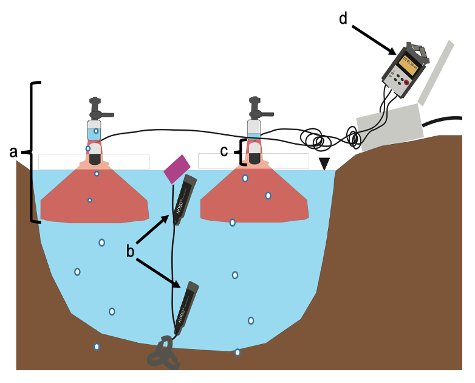

<h1>**Dissertation Work** </h1>
<h3> _University of New Hampshire (2014-2020)_ </h3>

 
<h2>Project Focus</h2> 

My PhD work centered on sub-arctic peatlands with a particular focus on methane (CH~4~) emissions from peatland thaw ponds.

_Investigating the spatial and temporal scale variability of ebullitive flux from a subarctic thaw pond system_
 
<h5>**Dissertation Chapters:**</h5>
  1. Long term measurements of methane ebullition from thaw ponds [Burke et al. (2019); _JGR Biogeosciences_](https://agupubs.onlinelibrary.wiley.com/doi/abs/10.1029/2018JG004786)
  2. Using unmanned aerial systems to monitor the change in thaw pond size over five growing seasons: Implications for CH~4~ ebullitive flux (in prep)
  3. Using acoustic techniques to monitor CH~4~ ebullition in subarctic thaw ponds
   

<figure>
  
  <figcaption>A thaw pond at Stordalen Mire, with some autochambers seen to the right of the pond.</figcaption>
</figure>
 

  

<h3> Study Site </h3>
My main study site is [Stordalen Mire](https://www.icos-sweden.se/station_stordalen.html), in northern Sweden, 200 km within the Arctic Circle. I used a combination of manual measurements, remote sensing (UAV imagery collection), and acoustical measurements to compile a seven year data set of ebullitive, or bubbling, measurements from these small ponds collected during the growing season (June - August).
   

<figure>
  
  <figcaption>Landing a quadcopter UAS at Stordalen Mire. _Photo Credit_: Ruth Varner.</figcaption>
</figure>

 

<figure>
  
  <figcaption>Manual sampling of some floating bubble traps. _Photo Credit_: Ruth Varner.</figcaption>
</figure>

<figure>
  
  <figcaption>Schematic showing acoustic bubble trap system.a) floating bubble trap, b) temperature loggers, c.) hydrophone, d.) recording device.
  </figcaption>
</figure>

          
My dissertation can be found [here](https://search-proquest-com.unh.idm.oclc.org/pqdtlocal1006039/docview/2423474482/19D86416B74641C2PQ/1?accountid=14612) 

   
   
   
   

<h2> **Additional Research Experience of Note**  </h2>
<h3> _Fulbright US Graduate Fellowship_</h3>
<h3> _University of Waikato, New Zealand (2015)_</h3>

 
 
<h3> Project Summary </h3>
Field site: [Kopuatai Peat Dome](https://www.doc.govt.nz/nature/habitats/wetlands/wetlands-by-region/waikato/kopuatai-peat-dome/), Waikato Region
 
Title: _Effect of drought on CH~4~ flux from Kopuatai Peat bog, Waikato: aboveground and belowground evidence_

My Fulbright project expanded upon previous work at this site by [Goodrich et al. (2015)](https://agupubs-onlinelibrary-wiley-com.unh.idm.oclc.org/doi/full/10.1002/2014JG002844) which found a strong hysteretic response of CH~4~ emissions post drought. My project paired aboveground eddy covariance measurements with nearby belowground measurements of porewater CH~4~ concentration and extracted peat cores used for incubations to see how rates of CH~4~ production varied at this site during a late-summer drought.      

 
<figure>
  
  <figcaption>Porewater sampling at Kopuatai._Photo Credit_: Dave Campbell.</figcaption>
</figure>

<figure>
  
  <figcaption>Eddy covariance tower at the site with CO~2~/H~2~0 and CH~4~ instruments attached to the horizontal boom (top right corner). The data logger box is to the left of the tower base.</figcaption>
</figure>

<figure>
  
  <figcaption>View of the solar panels used to power the EC tower at Kopuatai Peat Dome</figcaption>
</figure>

 
    
<h4> More Information: </h4>
Check out other research done by the Waikato Biogeochemistry and Ecohydrology Research group, [WaiBER](https://waiber.com/), out of Waikato University, with whom I worked on my Fulbright Research project.  

 

